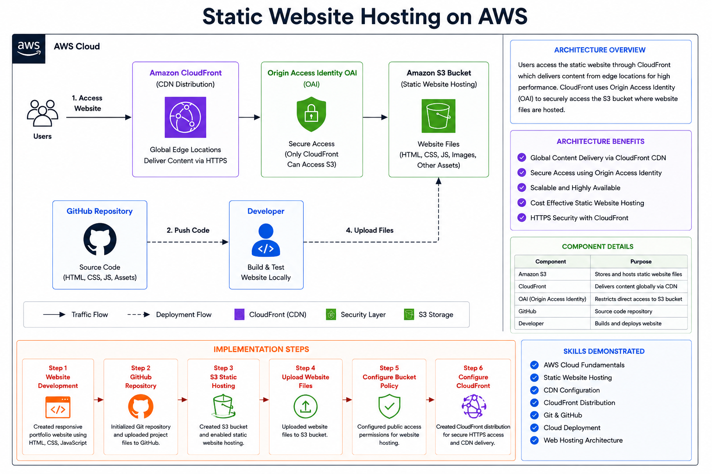
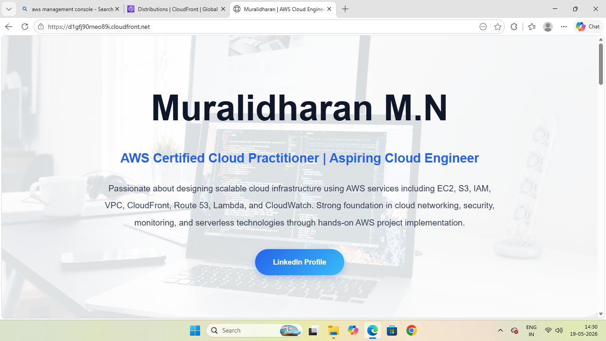
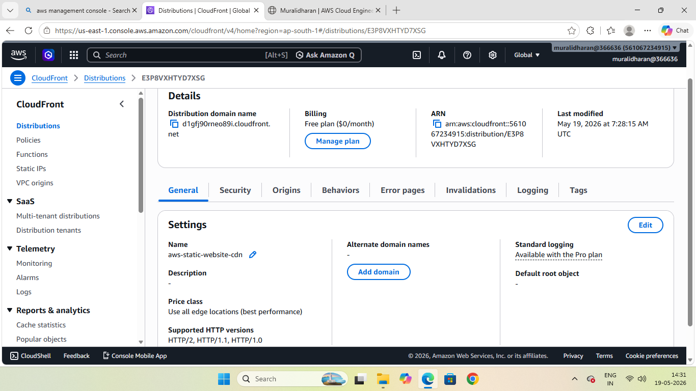
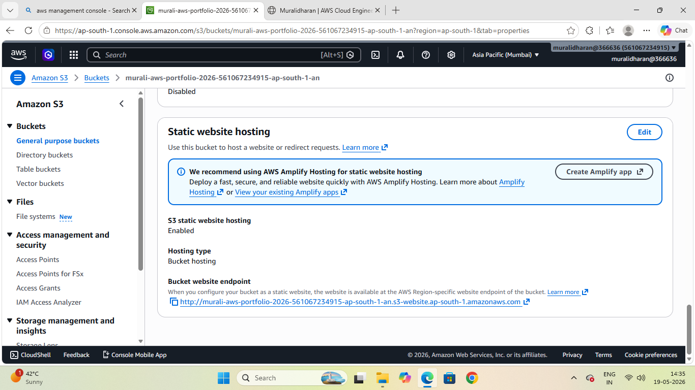
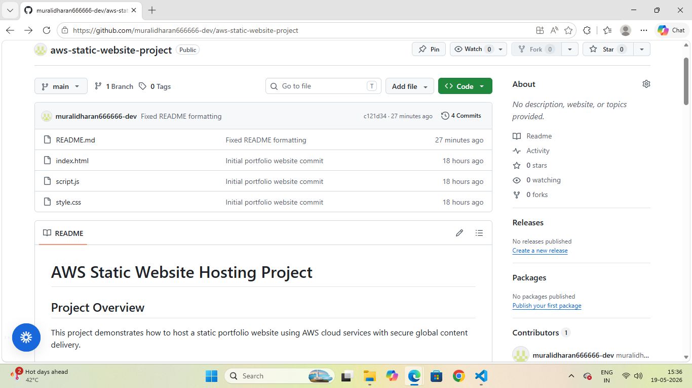

# AWS Static Website Hosting Project

## Project Overview

This project demonstrates how to host a static portfolio website using AWS cloud services with secure global content delivery.

The website was developed using HTML, CSS, and JavaScript and deployed using Amazon S3 and Amazon CloudFront.

---

# Live Website

https://d1gfj90rneo89i.cloudfront.net

---

# AWS Services Used

- Amazon S3
- Amazon CloudFront
- AWS IAM
- AWS CloudFront CDN
- GitHub

---

# Features

- Static portfolio website hosting
- HTTPS secure access
- Global content delivery using CDN
- Responsive web design
- GitHub version control
- Cloud deployment architecture

---
# Architecture

---
# Implementation Steps

## Step 1 — Website Development
Created responsive portfolio website using:
- HTML
- CSS
- JavaScript

## Step 2 — GitHub Repository
Initialized Git repository and uploaded project files to GitHub.

## Step 3 — S3 Static Hosting
Created S3 bucket and enabled static website hosting.

## Step 4 — Upload Website Files
Uploaded website files to S3 bucket.

## Step 5 — Configure Bucket Policy
Configured public access permissions for website hosting.

## Step 6 — Configure CloudFront
Created CloudFront distribution for secure HTTPS access and CDN delivery.

---

# Skills Demonstrated

- AWS Cloud Fundamentals
- Static Website Hosting
- CDN Configuration
- CloudFront Distribution
- Git & GitHub
- Cloud Deployment
- Web Hosting Architecture

---

# Screenshots

## Live Website

---

## CloudFront Distribution

---

## S3 Static Hosting

---

## GitHub Repository

---

# Project Status

Completed Successfully

---

# Author

Muralidharan M N
Cloud & DevOps Enthusiast
