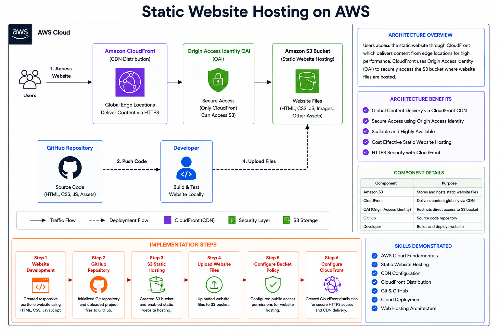
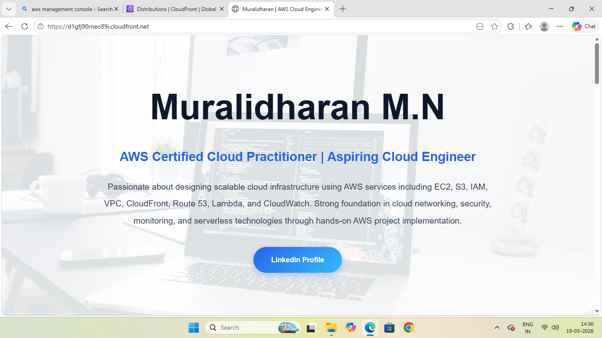
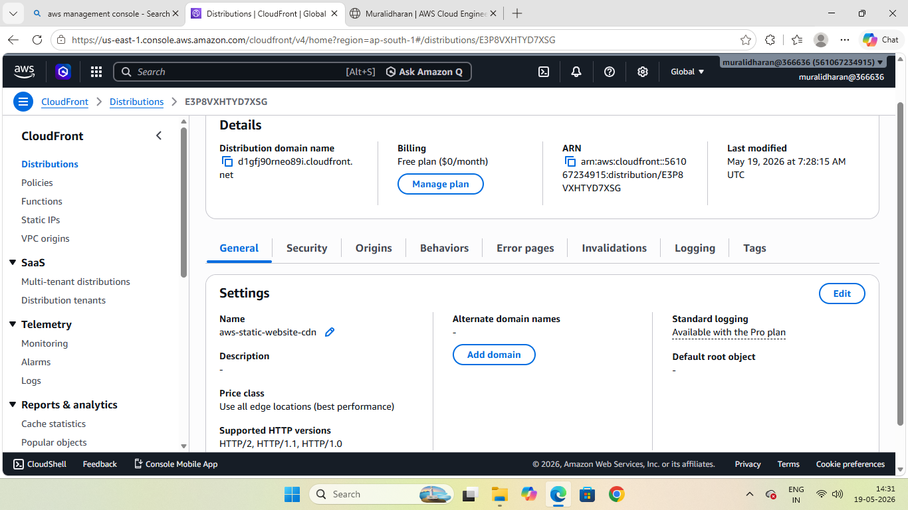
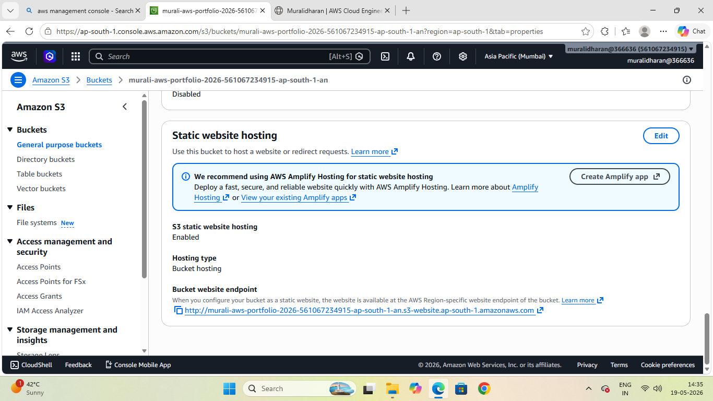
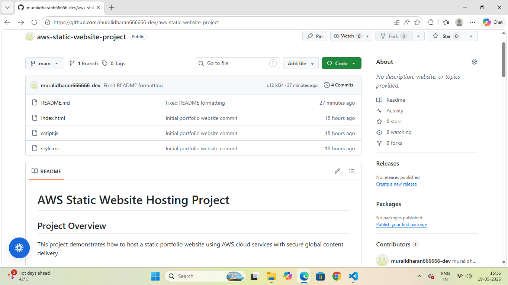

# Hosting My Portfolio on AWS — S3 + CloudFront

I wanted to move my portfolio off a free hosting platform and actually deploy it properly using AWS. My goal was to understand how S3 static hosting works, what CloudFront adds on top of it, and how to restrict bucket access so the site is only reachable through the CDN and not directly through the S3 endpoint.

**Live site:** https://d1gfj90rneo89i.cloudfront.net

---

## What I Built

A static portfolio site (HTML, CSS, JavaScript) deployed on Amazon S3 and served through CloudFront. The bucket is not publicly accessible on its own — traffic has to go through the CloudFront distribution, which handles HTTPS termination and caching.

---

## AWS Services I Used

- **Amazon S3** — stores the website files; static hosting is enabled with `index.html` as the default root object
- **Amazon CloudFront** — handles HTTPS, serves the content from an edge location, and is the only allowed origin for the bucket
- **AWS IAM** — created a policy to allow CloudFront to read from the S3 bucket (Origin Access Control)

---

## Architecture

User → CloudFront (HTTPS) → S3 bucket (private, read-only via OAC policy)

The bucket is not public. CloudFront uses an Origin Access Control (OAC) policy to authenticate requests to S3. The bucket policy only allows `s3:GetObject` from the specific CloudFront distribution ARN.

---

## What I Actually Did

### 1. Wrote the website
Basic HTML/CSS/JS portfolio. Nothing fancy — I wanted the AWS setup to be the main focus of this project.

### 2. Created the S3 bucket
Created a bucket in `ap-south-1` (Mumbai). I left "Block all public access" enabled from the start — I figured I'd set up CloudFront before deciding on permissions.

### 3. Enabled static website hosting
In the bucket properties, turned on static website hosting and set the index document to `index.html`. This creates an HTTP endpoint for the bucket but I didn't end up using it directly.

### 4. Uploaded the files
Uploaded `index.html`, `style.css`, and `script.js` via the S3 console. Later figured out you can drag-drop a whole folder and it preserves the structure.

### 5. Set up CloudFront with OAC
Created a CloudFront distribution with the S3 bucket as the origin. Instead of making the bucket public, I selected Origin Access Control and let CloudFront generate the OAC policy. It gave me a JSON bucket policy to copy into S3 — it restricts `s3:GetObject` to the specific CloudFront distribution ARN.

First attempt the distribution returned a 403. Turned out I had forgotten to paste the generated bucket policy into the S3 bucket permissions editor. Once I added that, it resolved.

### 6. Verified it worked
Opened the CloudFront domain in the browser and confirmed HTTPS was active. Then tried accessing the S3 static website endpoint directly — got a 403, which is exactly what I wanted. That confirmed the bucket was locked down to CloudFront only.

### 7. Pushed to GitHub
Pushed the project files to GitHub for version control. The live site stays up independently of the repo — S3 doesn't auto-deploy from GitHub in this setup.

---

## What I Learned

The part that took me longest was understanding the difference between making a bucket public versus using OAC. A lot of setups just enable public access on the bucket, which works but means anyone can hit the S3 endpoint directly and skip CloudFront entirely. The OAC approach keeps the bucket private — only CloudFront can read from it.

## Screenshots

### Live site via CloudFront

### CloudFront distribution settings

### S3 bucket static hosting config

### GitHub repo

---

## Author

**Muralidharan M N**

AWS Certified Cloud Practitioner | AWS re/Start Graduate

LinkedIn: https://www.linkedin.com/in/muralidharan-m-n-78a2522b8

GitHub: https://github.com/muralidharan666666-dev